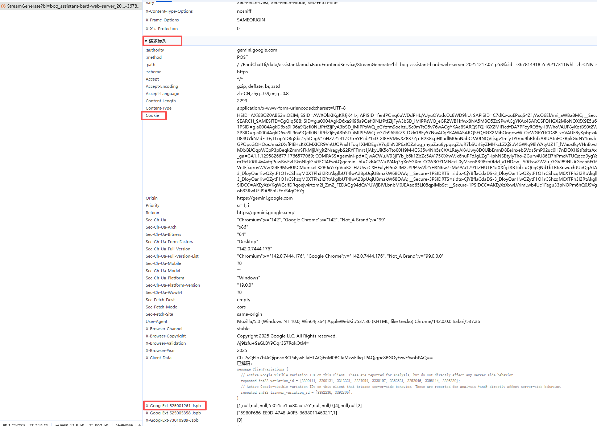

# Gemini Web 转 OpenAI API

基于 Gemini 网页版的逆向工程，提供 OpenAI 兼容 API 服务。

## ✨ 功能特性

- ✅ 文本对话 & 多轮对话
- ✅ 图片识别（支持 base64 和 URL）
- ✅ 多图片支持
- ✅ 图片生成（自动下载高清无水印原图）
- ✅ 视频生成（异步，需到官网查看）
- ✅ Token 自动刷新（后台定时刷新，防止失效）
- ✅ Tools / Function Calling 支持
- ✅ OpenAI SDK 完全兼容
- ✅ Web 后台配置界面

## 🚀 快速开始

### 1. 安装依赖

```bash
pip install -r requirements.txt
```

### 2. 启动服务

```bash
python server.py
```

### 3. 配置 Cookie

1. 打开后台 `http://localhost:8000/admin`（账号: admin / admin123）
2. 登录 [Gemini](https://gemini.google.com)，F12 → Network → 复制请求头中的 Cookie
3. 粘贴到后台配置页面，保存即可

Cookie 获取示例：



### 4. 调用 API

```python
from openai import OpenAI

client = OpenAI(
    base_url="http://localhost:8000/v1",
    api_key="sk-geminixxxxx"
)

response = client.chat.completions.create(
    model="gemini-3.0-flash",
    messages=[{"role": "user", "content": "你好"}]
)
print(response.choices[0].message.content)
```

## 📡 API 信息

| 项目     | 值                            |
| -------- | ----------------------------- |
| Base URL | `http://localhost:8000/v1`    |
| API Key  | `sk-geminixxxxx`              |
| 后台地址 | `http://localhost:8000/admin` |

### 可用模型

- `gemini-3.0-flash` - 快速响应
- `gemini-3.0-flash-thinking` - 思考模式
- `gemini-3.0-pro` - 专业版

## 💬 使用示例

### 文本对话

```python
from openai import OpenAI

client = OpenAI(base_url="http://127.0.0.1:8000/v1", api_key="sk-geminixxxxx")

response = client.chat.completions.create(
    model="gemini-3.0-flash",
    messages=[{"role": "user", "content": "你好，介绍一下你自己"}]
)
print(response.choices[0].message.content)
```

### 单图片识别

```python
import base64
from openai import OpenAI

client = OpenAI(base_url="http://127.0.0.1:8000/v1", api_key="sk-geminixxxxx")

def load_image_base64(path):
    with open(path, "rb") as f:
        return base64.b64encode(f.read()).decode()

img_b64 = load_image_base64("image.png")

response = client.chat.completions.create(
    model="gemini-3.0-flash",
    messages=[{
        "role": "user",
        "content": [
            {"type": "text", "text": "描述这张图片"},
            {"type": "image_url", "image_url": {"url": f"data:image/png;base64,{img_b64}"}}
        ]
    }]
)
print(response.choices[0].message.content)
```

### 多图片问答


```python
import base64
from openai import OpenAI

client = OpenAI(base_url="http://127.0.0.1:8000/v1", api_key="sk-geminixxxxx")

def load_image_base64(path):
    with open(path, "rb") as f:
        return base64.b64encode(f.read()).decode()

img1_b64 = load_image_base64("a.png")
img2_b64 = load_image_base64("b.png")

response = client.chat.completions.create(
    model="gemini-3.0-pro",
    messages=[{
        "role": "user",
        "content": [
            {"type": "text", "text": "把科比手里的烤串换成另外一张图的枪,多生成几张"},
            {"type": "image_url", "image_url": {"url": f"data:image/png;base64,{img1_b64}"}},
            {"type": "image_url", "image_url": {"url": f"data:image/png;base64,{img2_b64}"}},
        ]
    }]
)
print(response.choices[0].message.content)
```

### 图片生成

```python
from openai import OpenAI

client = OpenAI(base_url="http://127.0.0.1:8000/v1", api_key="sk-geminixxxxx")

response = client.chat.completions.create(
    model="gemini-3.0-pro",
    messages=[{"role": "user", "content": "生成一张可爱的猫咪图片"}]
)
print(response.choices[0].message.content)
```

## 🔧 Token 管理

后台页面左上角显示 Token 状态和刷新次数。

API 端点：
- `GET /v1/token/status` - 查看状态
- `POST /v1/token/refresh` - 手动刷新
- `POST /v1/client/reset` - 重置客户端

## ⚙️ 配置说明

编辑 `server.py` 顶部：

```python
API_KEY = "sk-geminixxxxx"           # API 密钥
PORT = 8000                           # 端口
ADMIN_USERNAME = "admin"              # 后台账号
ADMIN_PASSWORD = "admin123"           # 后台密码
TOKEN_REFRESH_INTERVAL_MIN = 200      # 刷新间隔最小秒数
TOKEN_REFRESH_INTERVAL_MAX = 300      # 刷新间隔最大秒数
MEDIA_BASE_URL = ""                   # 媒体外网地址，如 https://your-domain.com
```

## 📁 文件说明

| 文件/文件夹        | 说明                                |
| ------------------ | ----------------------------------- |
| `server.py`        | API 服务 + Web 后台                 |
| `client.py`        | Gemini 逆向客户端                   |
| `demo_chat.py`     | 完整调用示例（文本/单图/多图/生成） |
| `media_cache/`     | AI 返回图片的中转缓存文件夹         |
| `image.png`        | Cookie 获取示例图                   |
| `a.png` / `b.png`  | 多图问答示意图                      |
| `requirements.txt` | Python 依赖                         |
| `config_data.json` | 运行时配置（自动生成）              |

## 📄 License

MIT
